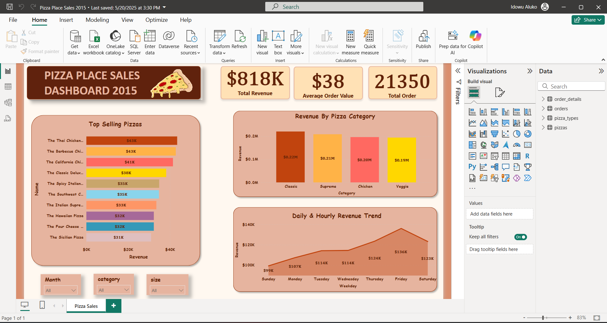

# Pizza Place Sales Dashboard – Power BI Project

## Problem Statement

The management of a pizza restaurant wants to better understand their 2015 sales performance. They need a data-driven approach to identify:

* Which pizzas and categories generate the most revenue
* Sales performance across weekdays and hours
* Trends in customer purchasing behavior
* Areas to focus on for growth and operational efficiency

---

## Overview

This project uses real pizza sales data to create an interactive Power BI dashboard that visualizes key business metrics such as revenue, order volume, best-selling products, and time-based trends. The dashboard is designed with a custom warm pizza-themed visual style for engagement and storytelling.

---

## Objectives

* Analyze total revenue, average order value, and total order volume
* Identify top-performing pizzas and categories
* Uncover revenue patterns by day and hour
* Enable filtering by size, category, and month
* Create an intuitive and visually appealing report to support decision-making

---

## Dataset Information

The project is based on 3 interrelated tables:

* `orders`: Contains order date and time
* `order_details`: Contains quantity and pizza ID per order
* `pizza_types`: Describes each pizza’s name, category, and ingredients
* `pizzas`: Contains pizza's size and price

Each table is connected via relational keys to allow effective data modeling.

---

## Data Source

Dataset: [Kaggle - Pizza Sales Dataset](https://www.kaggle.com/datasets/mysarahmadbhat/pizza-place-sales)

---

## Analysis Tools & Skills Used

* **Power BI**: Data modeling, DAX, custom visualizations, slicers, bookmarks
* **DAX**: Calculated columns and measures for revenue, AOV, totals, day names, and more
* **Data Transformation**: Power Query Editor to clean and format data
* **Custom Theme**: Designed a warm, pizza-inspired JSON theme for visual storytelling
* **Visual Design**: Card KPIs, bar charts, line charts, slicers, and tooltips
* **Drill Up/Down**: To switch between the daily and hour trend

---

## Key Insights
### Dashboard

* **Total Revenue**: \$818K
* **Top-Selling Pizza**: The Thai Chicken Pizza (\~\$43K revenue)
* **Most Profitable Category**: Classic pizzas led the category in total revenue
* **Peak Day**: Friday recorded the highest revenue
* **Lowest Sales Day**: Sunday had the lowest average sales
* **Hourly Trend**: Revenue peaked during lunch and evening hours

---

## Recommendations

* Promote high-performing pizzas like Thai Chicken and Barbecue Chicken
* Boost marketing efforts and discounts on lower-performing days (Sunday)
* Consider bundle deals or promos on popular pizza categories
* Use weekday and hourly trends to optimize staffing and delivery capacity
* Explore ingredient-based combinations for new pizza innovation

---

## Conclusion

This project demonstrates how Power BI can transform raw sales data into a compelling, insight-rich dashboard. The clear visuals and interactive features provide actionable insights to guide business strategy in the food and beverage industry.
